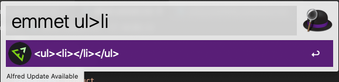

Alfred 上で Emmet の変換が使える Alfred workflow です。

## 使い方

npm からインストールしてください。インストールすると自動的に Alfred workflow に登録されます。

```
$ npm install --global alfred-emmet
```

Alfred で `emmet {query}` をタイプしてください。結果を選択するとクリップボードにコピーすることができます。



## モチベーション

react とか vue コンポーネントとか作ってるときに、Emmet 効かなくてカッとなって作った。
