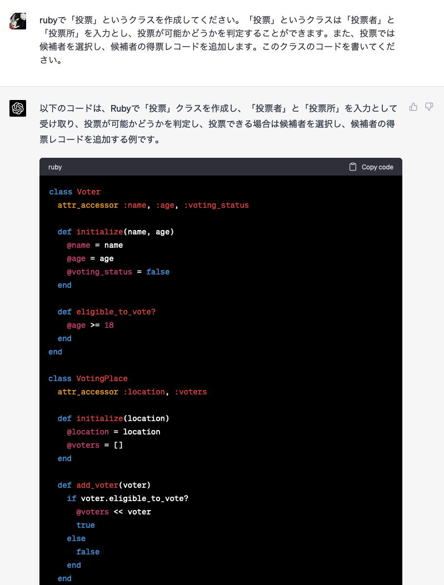
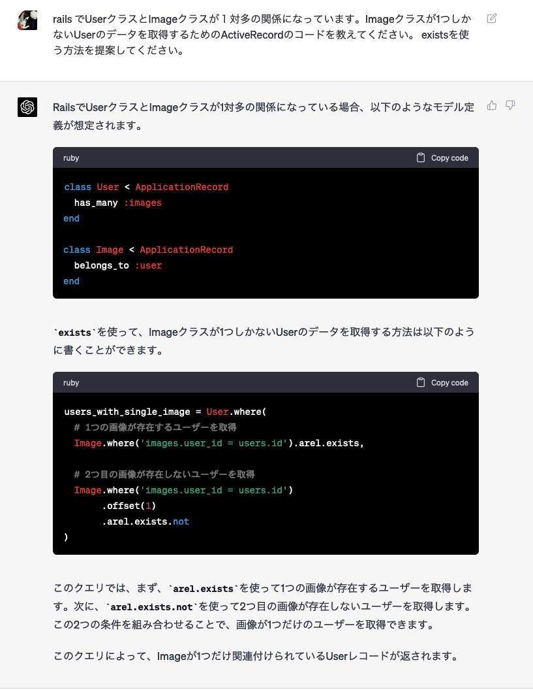
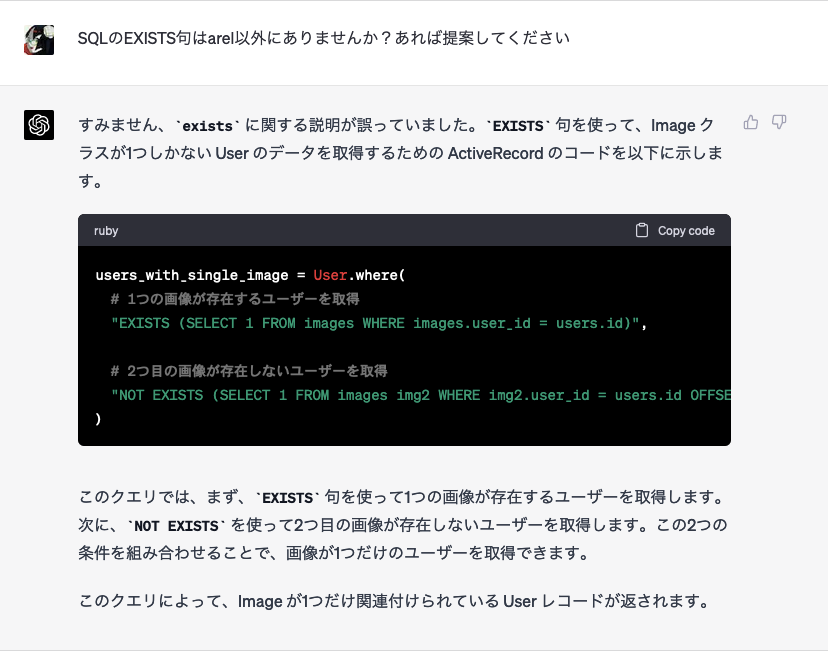
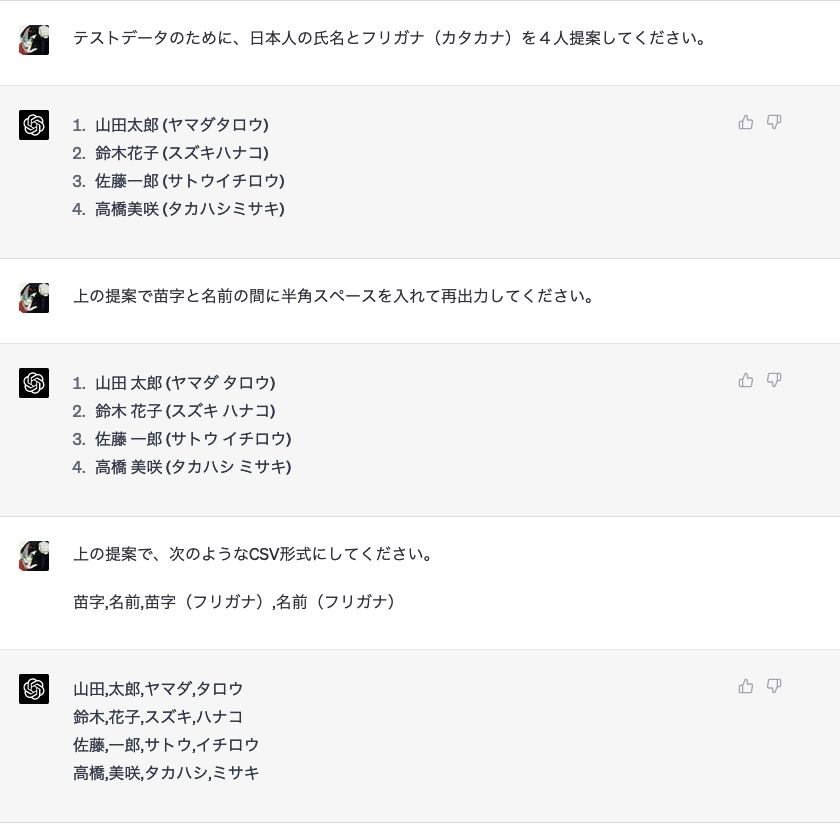
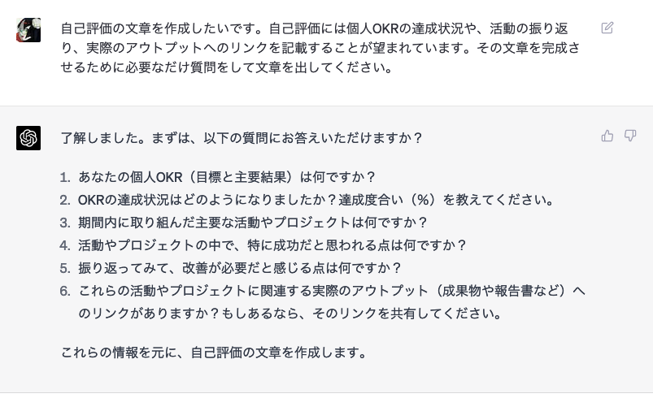
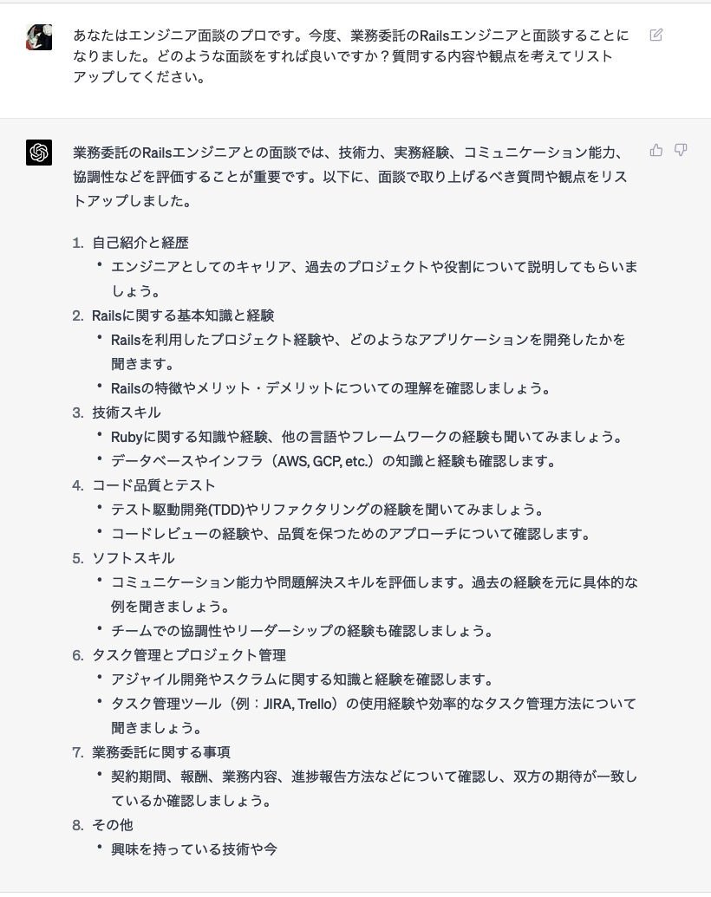
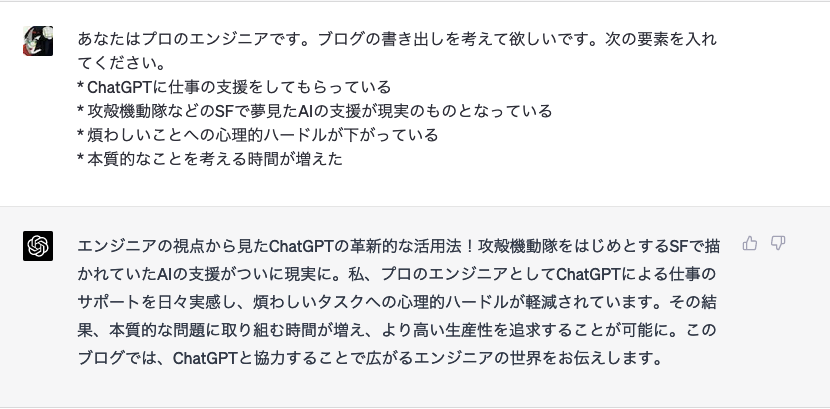

攻殻機動隊をはじめとするSFで描かれていたAIの支援がついに現実のものとなってきた気がする。
ChatGPTによる仕事のサポートを日々実感している。
材料さえ投げ込めばいい感じに生成してくれる体験は煩わしいタスクへの心理的ハードルが軽減されている。
その結果、本質的な問題に取り組む時間が増え、より高い生産性を追求することが可能になった。

クラスを作成するときはその本質的な役割について考えるようになった。
クラスがどんな責務を持ち、どんなインターフェースを持ち、何を行うのか考え、コードはAIが生成してくれる。

 

ActiveRecord関係のややこしいクエリの発行方法も相談して解決した。

 

arelでの解決は気に食わなかったので、EXISTS句を使うように指定したらあっさり解決した。

 

テストデータもChatGPTで作っている。もはや山田太郎以降の人名を考える必要が人間にはないのだ。

 

個人目標の振り返りも手伝ってもらった。ChatGPTからの質問に答えることでいい感じの文章を作成することができた。まるでマネージャーだな。

 

突然の面談でも大丈夫。ChatGPT先生が質問を考えてくれるからね。

 

ちなみにこの記事も手伝ってもらった。

 

いい感じに描きすぎなのでは？