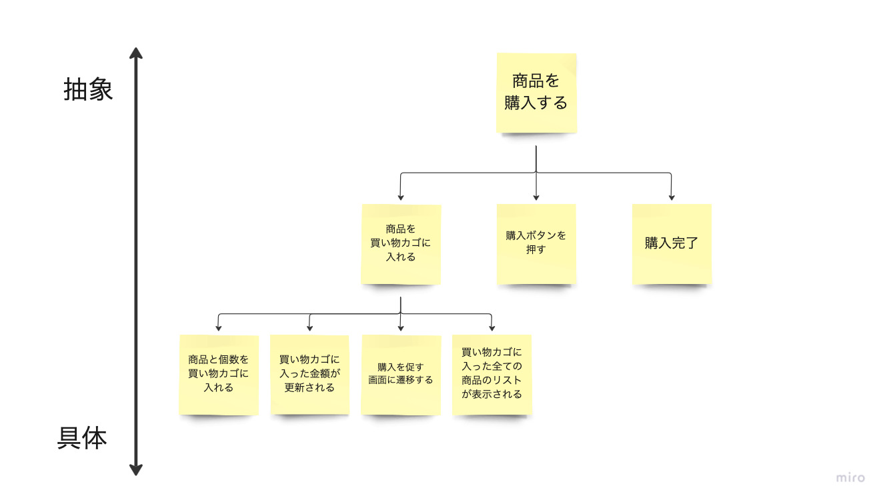

普段、コードリーディングで気をつけていること。意図して行っていことを言語化しようと考えたのでご紹介します。


## 抽象と具体を行き来する



コードを読む際には、抽象的な概念から具体的な実装へと行き来することが大切です。

例えば、ECサイトで商品を購入する機能の場合、

1. 商品を買い物カゴに入れる
2. 購入ボタンを押す
3. 購入完了

これらをより具体的な機能に分解することができます。
さらに、「商品を買い物カゴに入れる」を分解していくと、

1. 商品と個数を買い物カゴに入れる
2. 買い物カゴに入った金額が更新される
3. 購入を促す画面に遷移する
4. 買い物カゴに入った全ての商品のリストが表示される

と、具体的な情報に落とし込み、最終的に次のようなソースコードにたどり着きます。

```
class ShoppingCart
  attr_reader :items

  def initialize
    @items = []
  end

  def add_item(item)
    @items << item
  end

  def remove_item(item_name)
    @items.delete_if { |item| item[:name] == item_name }
  end

  def total_price
    @items.inject(0) { |sum, item| sum + item[:price] }
  end

  def display_cart
    @items.each do |item|
      puts "商品名: #{item[:name]}, 価格: #{item[:price]}円"
    end
    puts "合計金額: #{total_price}円"
  end
end
```

この抽象的な概念から具体的なコードへの行き来が、コードリーディングを進める上で重要です。


## クラスの構造を理解する

クラスの構造を理解することで、コードの理解が容易になります。継承やインターフェースの関係を明確に把握することで、各クラス間の依存関係や動作の流れが分かりやすくなります。
特にインターフェースは、どのように実現しているかではなく、何をしているかがコードを理解する上で重要です。

ただし、いくら上記のコツを実践しても、責務が重積しているコード（いわゆる「クソコード」）では、効果が薄れることがあります。このような場合は、まずコードのリファクタリングを行い、責務の明確化や構造の整理をすることが重要です。

