## TLTR

マイクロサービスが正常に動作していることをチェックするためのアーキテクチャパターンとしてDeep Health Checkパターンが存在します。これを使うことで単にリクエストが受け付けられるだけでなく、DBや他のマイクロサービスとの通信を含めたリクエストを正常に返せるかということをチェックすることができます。

## ヘルスチェックとは

ヘルスチェックとはサービスが正常に動作していることをチェックする仕組みです。
ロードバランサーを使用して複数のインスタンスを稼働させている時、ヘルスチェックの仕組みを使うことで正常に動作しないサービスにリクエストを投げずに済みます。
単にリクエストを受け付けられるのを確認するだけならば、次のようなコードで十分でしょう。

```
app.get('/health', (req, res) => {
  res.send('OK')
})
```

<br />

一方、マイクロサービスではそのサービスが正常に動作するかは他のマイクロサービスの状態やDB、外部のサービスの状態に依存します。
そのため、サービスが依存しているリソースの状態を含めてヘルスチェックを行うアーキテクチャパターンを「Deep Health Checkパターン」と呼びます。
下はイメージ図です。




また、ヘルスチェックのフォーマットには次のようなRFC（2021/07時点ではドラフト）があるのでそれに従うと良いでしょう。
[Health Check Response RFC Draft for HTTP APIs](https://datatracker.ietf.org/doc/html/draft-inadarei-api-health-check)

例えばこのようなフォーマットです。
```
{
  "status": "pass",
  "version": "1",
  "releaseId": "1.2.2",
  "notes": [""],
  "output": "",
  "serviceId": "f03e522f-1f44-4062-9b55-9587f91c9c41",
  "description": "health of hoge service",
  "checks": {
    "cassandra:responseTime": [
      {
        "componentId": "dfd6cf2b-1b6e-4412-a0b8-f6f7797a60d2",
        "componentType": "datastore",
        "observedValue": 250,
        "observedUnit": "ms",
        "status": "pass",
        "affectedEndpoints": [
          "/users/{userId}",
          "/customers/{customerId}/status",
          "/shopping/{anything}"
        ],
        "time": "2018-01-17T03:36:48Z",
        "output": ""
      }
    ],
    "cassandra:connections": [
      {
        "componentId": "dfd6cf2b-1b6e-4412-a0b8-f6f7797a60d2",
        "componentType": "datastore",
        "observedValue": 75,
        "status": "warn",
        "time": "2018-01-17T03:36:48Z",
        "output": "",
        "links": {
          "self": "http://api.example.com/dbnode/dfd6cf2b/health"
        }
      }
    ],
    "fuga:connections": [
      {
        "componentId": "6fd416e0-8920-410f-9c7b-c479000f7227",
        "node": 1,
        "componentType": "system",
        "observedValue": 85,
        "observedUnit": "percent",
        "status": "warn",
        "time": "2018-01-17T03:36:48Z",
        "output": ""
      }
    ]
  },
  "links": {
    "about": "http://api.example.com/about/hoge",
    "http://api.x.io/rel/thresholds": "http://api.x.io/about/hoge/thresholds"
  }
}
```


### 参考文献

* http://en.clouddesignpattern.org/index.php/CDP:Deep_Health_Check%E3%83%91%E3%82%BF%E3%83%BC%E3%83%B3
* https://datatracker.ietf.org/doc/html/draft-inadarei-api-health-check

