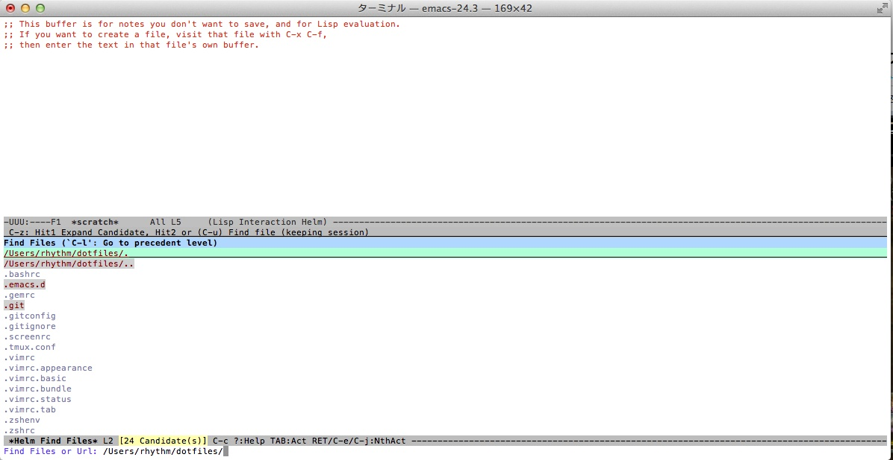
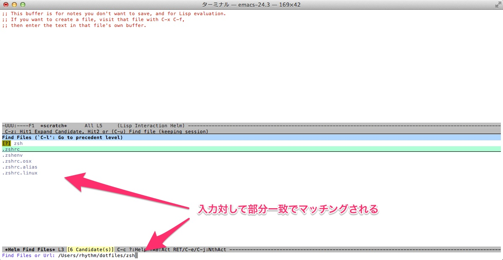
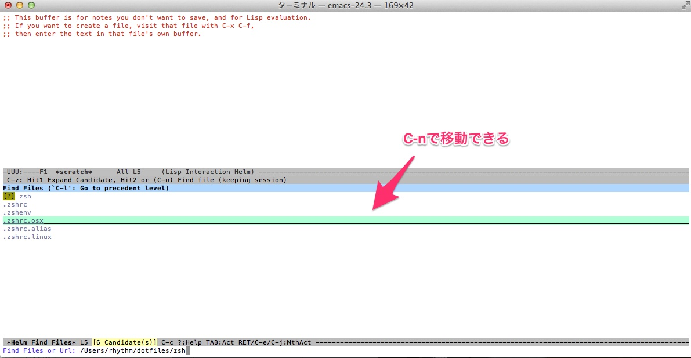
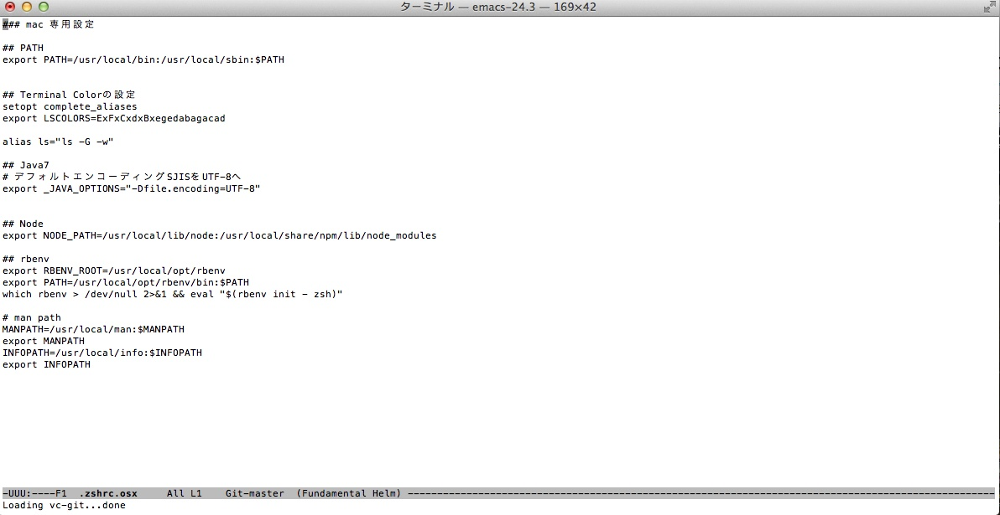
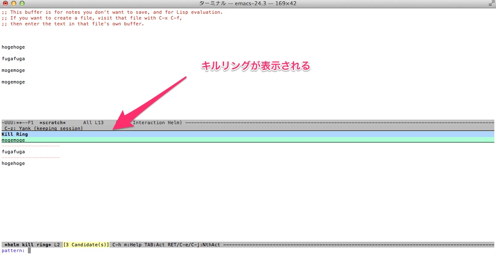
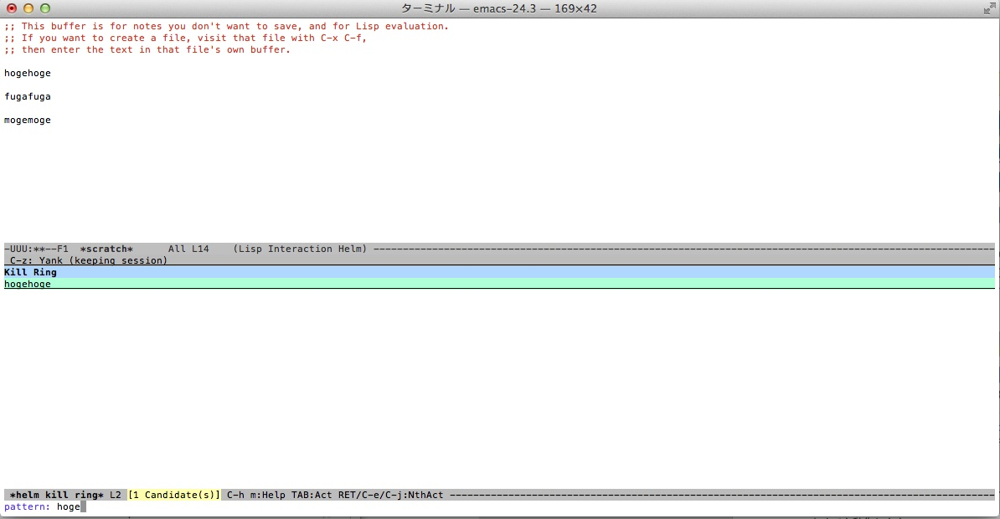
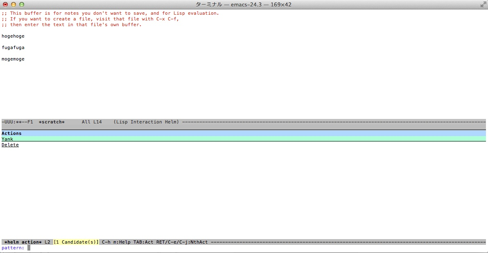
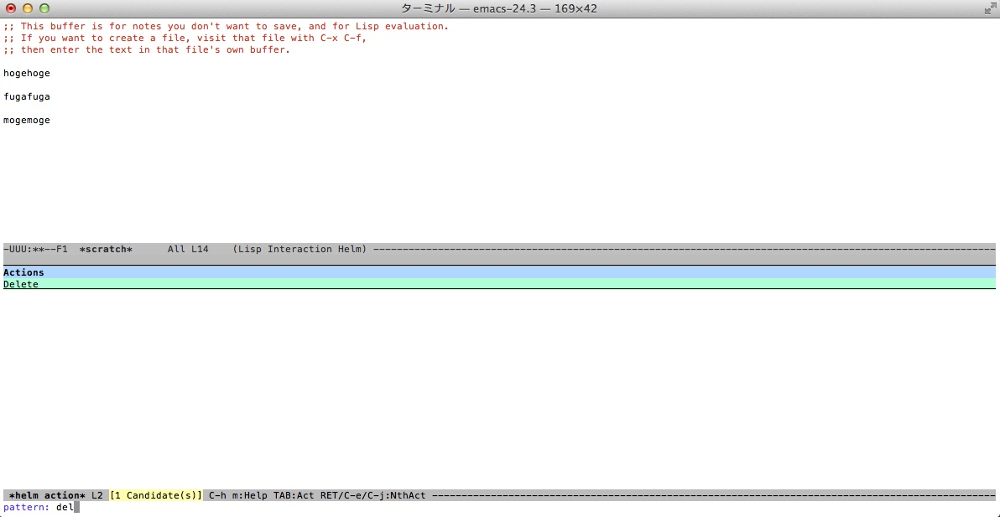

emacs の helm についてインストール以前の話があまりされていないので丁寧な解説をしたいと思う。

helm とは emacs に統一的なある”操作方式”を提供するフレームワークである。
helm で提供される操作方式では、ある情報(ファイル名、バッファ名など)に対して、

1. インクリメンタルなパターンマッチによる絞り込みを行い、
2. 対象の情報を選択し、
3. 対象の情報に対してアクション(ファイルを開く、削除する)を行う

の 3 段階の操作方式を提供する。
このフレームワーク上で作られた機能は全て同じ操作方式で機能を利用することができる。

もう少し具体的な話としてファイルを開く helm-find-files を紹介しよう。
C-x C-f からファイルを開く場合、通常ならポインタがミニバッファに移動し、ファイル名を入力してファイルを開いていた。
ファイル名の入力は基本的には記憶に頼る物で、TAB による補完機能も前方一致のみだった。
helm ではカレントディレクトリのファイルが候補として表示される。

ここで”zsh”と入力することで部分一致によるマッチングが行われ、候補となるファイルが絞り込まれる。

このままファイル名を入力してしまってもいいのだが、
C-n や C-p によって対象を選択することができる。

開きたいファイルを選択したら RET で開くことができる。

別の例も紹介しよう。

過去にカット・コピーされた内容を取り出す M-y コマンドは、通常なら M-y を押すたびに表示されるペースト結果を見て一喜一憂しながらペーストをしていた。
helm では先ほどのファイル操作と同様の操作方法でペーストを実行できる。実際に見てみよう。
M-y を押すとキルリングの候補と現在のパターンマッチが表示される。

ここで”hoge”と入力することで候補となるテキストが絞り込まれる

そして RET すれば貼付けられるのだが、TAB を押してみよう。
TAB を押すことでこのテキストに対して行えるアクションが表示される。
ここでは張り付け(ヤンク)と削除のアクションが用意されている。

RET では最も利用されるアクション(この場合は張り付け)がデフォルトとして割り当てられていたが、複数のアクションが用意されていることもある。
このアクションの選択画面でも入力による絞り込みや C-n や C-p による移動ができる。
ここでは削除を選択してキルリングから削除してしまおう。サヨナラ！

この 絞り込み -> 選択 -> アクション の操作性を様々な機能に提供するのが helm の本質である。
