セマンティックバージョニングに関しては [公式サイト](https://semver.org/lang/ja/) をみてもらうのが一番良いのだが、わかりやすいようにフローチャートを書きました。

## 補足

セマンティックバージョニングは、ライブラリを使う側が新しいバージョンを取り込むべきかを機械的に判断するためにあります。機械的に判断できるからこそ、[Dependabot](https://dependabot.com/) のようにバージョンアップを自動化することができるのです。

セマンティックバージョンでは、

- API の変更に互換性のない場合はメジャーバージョンを、
- 後方互換性があり機能性を追加した場合はマイナーバージョンを、
- 後方互換性を伴うバグ修正をした場合はパッチバージョンを上げます。

となっていますが、そのライブラリを使う側は、

- パッチバージョン: 何も考えずに取り込んで良い
- マイナーバージョン: 自動テストが通る限り取り込んで良い
- メジャーバージョン: 取り込むには何かしらの修正が必要

と考えることができるようになるのです。
