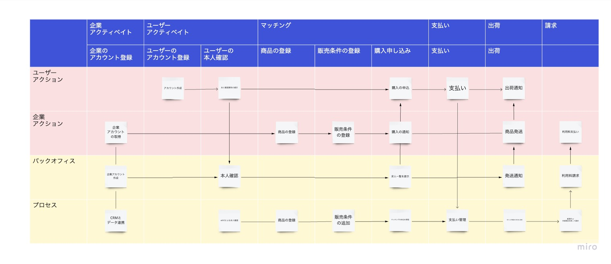
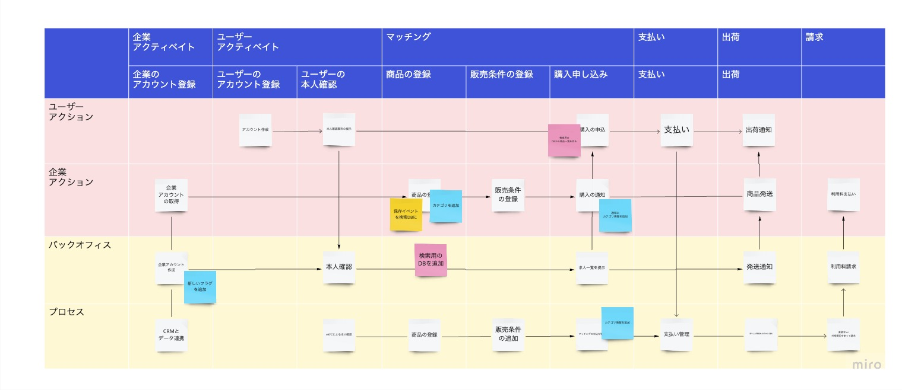

新機能の開発を行う際には、その新機能が既存のシステムにどのような影響を与えるかを正確に理解することが重要です。
そのために、システム全体のブループリントを作成し、洗い出すことで、影響範囲の予測や分析を行うことが可能になります。
今回は、その手法と利点について説明します。

## サービスブループリントとは

サービスブループリントは、「サービスが提供されるまでのプロセスを、ユーザー体験、サービス提供者やシステムの動きと合わせて時系列で表すツール」のことです。
ユーザーとサービス提供者、システムの動きを視覚化することが可能で、それによりサービスの全貌を理解するのに役立ちます。

## 新機能の影響範囲を洗い出す

新機能を開発する際には、その機能がシステム全体に与える影響を評価することが必要です。
サービスブループリントを使用すると、新機能が影響を及ぼす可能性のあるサービスの部分を視覚的に確認し、予測することができます。
例えば、新機能がユーザーの操作フローに影響を及ぼす場合、その影響はサービスブループリント上で明確に表示され、その結果を洗い出すことができます。

## チームでの分析

サービスブループリントはチーム全員で共有することができ、RDRA（リレーションシップ駆動要件分析）のように、全員でサービス全体を俯瞰して、影響範囲やリスクを議論することができます。
具体的には、miro上にサービスブループリントを配置し、コメントや付箋を使って、新機能がどこに影響を及ぼすかを議論することが可能です。
これにより、各メンバーがサービス全体の理解を深め、新機能の影響に対する理解も共有することができます。

## まとめ

新しい機能を追加する際には、その影響範囲を正確に理解することが重要です。
サービスブループリントを使用すれば、サービス全体の視覚的な表現を作成し、その影響範囲を予測しやすくすることができます。
さらに、チーム全体でこのサービスブループリントを共有することで、全員がサービス全体と新機能の影響を理解し、その結果を共有することができます。

