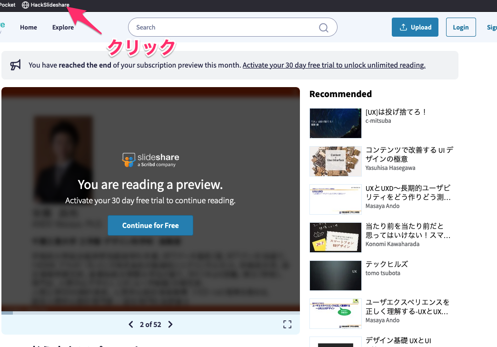

Slideshareの有料化に伴って、無料ユーザーには閲覧に制限がかかるようになりました。その閲覧制限を外すブックマークレットです。ご利用は計画的に

次のリンクのブックマークを作り、slideshareの画面で実行すると良いです。

<a href="javascript:(function(){var a=document.createElement('style');a.innerHTML='#new-player%20.limit-overlay%20{%20display:%20none%20!important;%20}';document.body.append(a)})();" >HackSlideshare（このリンクをブックマーク）</a>

使い方は"You are reading a preview"が表示されたら先ほど作ったブックマークをクリックします。

 

good luck!