Nuxt（フロントエンド）とfastify（バックエンド）を使って認証環境を構築したときのサンプルプログラムと解説を行います。
完成したサンプルプログラムはこちらです。

https://github.com/rhythm191/nuxt-auth-example

## 概要

フロントエンドは[Nuxt](https://nuxtjs.org/ja/)で認証ライブラリは [nuxt/auth](https://auth.nuxtjs.org/)を使っており、
バックエンドは[fastify](https://www.fastify.io/)で認証ライブラリは[fastify-passport](https://www.npmjs.com/package/fastify-passport)で構築しています。





## Nuxt（フロントエンド）側

フロントエンドのNuxt側はnuxt/authを使って認証の管理を行います。
まずはライブラリをインストールをします。

```
npm install --save-exact @nuxtjs/auth-next
npm install @nuxtjs/axios
```

今回はデフォルトの`local`のスキーマを使うように、nuxt.config.jsを次のように設定する。

```
  modules: [
    '@nuxtjs/axios',
    '@nuxtjs/auth-next',
  ],

  router: {
    // globalで認証が必要にする
    middleware: ['auth'],
  },

  axios: {
    baseURL: `http://localhost:3001/`,
  },

  auth: {
    strategies: {
      local: {
        token: {
          property: 'token',
          global: true,
        },
        user: {
          property: 'user',
        },
        endpoints: {
          login: { url: '/auth/login', method: 'post' },
          logout: { url: '/auth/logout', method: 'post' },
          user: { url: '/auth/user', method: 'get' },
        },
      },
    },
  },
```

認証済みの場合、`$auth`プロパティにログイン済み情報やバックエンドから取得したユーザー情報が格納されます。

```
  methods: {
    someMethod() {
      if (this.$auth.loggedIn) {
        console.log(this.$auth.user)
      } else {
        console.log("not authenticate")
      }
    },
  },
```


## fastify（バックエンド）側

バックエンド側のfastifyは`fastify-passport`を使って認証を管理します。
fastify-passport は [passportjs](https://www.passportjs.org/) というexpress.jsで有名なライブラリをfastifyに適用したライブラリです。
nust/authのlocalのスキーマは Authorizationヘッダーを用いたBearer認証（`Authorization: Bearer some-secret-token`が飛んでくるやつ）を行うので、そのためのpassportストラテジーとして[passport-http-bearer](https://www.passportjs.org/packages/passport-http-bearer/)を使うと良いです。


まずはライブラリをインストールをします。

```
npm install fastify-passport fastify-secure-session passport-http-bearer
```

そして認証系の設定をします。
このサンプルではトークンの文字列を見て適当に判断していますが、実際にはトークンからユーザー情報を取得して、取得の可否によって認証・非認証を判断すれば良いと思います。

```
import Fastify, { FastifyReply, FastifyRequest } from "fastify";
import fastifyPassport from "fastify-passport";
import fastifySecureSession from "fastify-secure-session";
import { Strategy as BearerStrategy } from "passport-http-bearer";

const fastify = Fastify({
  logger: true,
});

fastify.register(fastifySecureSession, {
  key: "super-secret-key-fjeowafjoeijwafiowjfoejawoifjaow",
});
fastify.register(fastifyPassport.initialize());
fastify.register(fastifyPassport.secureSession());

fastifyPassport.use(
  new BearerStrategy(function (token, done) {
    // 実際にはトークンを使ってユーザー情報を取りにき、その結果で返す。
    // サンプル例では単純にtokenの値を見て判断する
    if (token !== "some-secret-token") {
      done("not authenticate");
    }

    return done(null, { username: "test" }, { scope: "all" });
  })
);

// ログイン認証部分
fastify.post(
  "/auth/login",
  (
    request: FastifyRequest<{ Body: { username: string; password: string } }>,
    reply: FastifyReply
  ) => {
    if (request.body.username === "test") {
      reply.code(200).send({ token: "some-secret-token" });
    } else {
      reply.code(401).send();
    }
  }
);
```

認証済みかどうかの判断は`preValidation`で行います。
`preValidation`で`fastifyPassport.authenticate`を行うことで認証済みかどうかを判断します。
認証済みの場合は以降の処理に移り `request.user` にpassportストラテジーないで定義したユーザー情報が付与されます。

```
fastify.get(
  "/auth/user",
  { preValidation: fastifyPassport.authenticate("bearer", { session: false }) },
  (request: FastifyRequest, reply: FastifyReply) => {
    // 認証をパスした場合、request.userでユーザー情報にアクセスできる
    console.log(request.user);

    const user = request.user as { username: string };

    reply.code(200).send({ user: { username: user.username } });
  }
);
```
