エンジニアを10年間続けてきた中で、良い開発ができるように心掛けてきました。
その暗黙知を形式化する機会を得られたので、このブログにも残しておく。

私が常日頃気をつけていることは次の３つだ。

1. 良い品質を保つからこそパフォーマンスも良い
2. 観察と予測
3. シンプルを保つ

## 良い品質を保つからこそパフォーマンスも良い

１つ目は「良い品質を保つからこそパフォーマンスも良い」だ。

これは[LeanとDevOpsの科学](https://www.amazon.co.jp/dp/B07L2R3LTN/)で統計的に明らかになったことだし、[t_wada](https://speakerdeck.com/twada/quality-and-speed-2022-spring-edition)さんも常に言っていることだ。
下の表はLeanとDevOpsの科学に記載されている、ソフトウェアデリバリーの４つのパフォーマンス指標と、調査研究の分析結果だ。

|                    | ハイパフォーマー | ミディアムパフォーマー | ローパフォーマー |
|--------------------|------------------|------------------------|------------------|
| デプロイ頻度       | １日数回         | 週１回から月１回       | 週１回から月１回 |
| 変更のリードタイム | １時間未満       | １週間から１ヶ月       | １週間から１ヶ月 |
| 平均修復時間       | １時間未満       | １日未満               | １日から１週間   |
| 変更失敗率         | ０〜１５％       | ０〜１５％             | ３１〜４５％     |

この表を見てわかる通り、品質とパフォーマンスはトレードオフの関係にはなく、むしろ品質が良いからこそパフォーマンスが良いと言える。

ではここで保つべき品質とはなんだろうか？

ソフトウェアは"表面上動いている"こと以上に気をつけるべき、見えざる品質項目が多い。
例えば、コードの可読性、メンテナンス性、スケーラビリティ、セキュリティ、オブザーバービリティ、etc...
イメージ的には次のような感じだ。

では、この隠れた品質を考慮せず、"表面上動いてる"程度の品質で開発が進んだ場合どうなるか？
これは私の経験だが、スタートアップで良くある"時間がないのでとりあえず品質"で開発すると、より時間がなくなるという負のサイクルが発生しているように思う。
つまり、

1. 時間がないのでとりあえず品質で開発する
2. 後日想定外の運用や問題が発見される
3. コードの可読性が低かったり、監視体制が十分ではないので対処に時間がかかる
4. 時間がなくなる
5. 1に戻る

この負のサイクルを回避するために、品質を高めたり、そもそも悪い品質を避けたりする必要があるのだ。
もし、開発部長が突然やってきて「品質はいいから早くリリースするのだ」と言ってきても、鼻っ柱をへし折ってでも止めなければならない(<a href="#annotation_1">*1</a>)

## 観察と予測

突然UXの話をするのだが、UXを時間軸で説明するという考え方がある。
例えばECサイトで物を購入するUXの前後には、「使いやすいECサイトって友人から聞いた」のような利用前のUXと「別の友達におすすめした」という利用後のUXがあり、
これらのUXを何度も繰り返した長期的な視点が累積的UXと呼ぶそうだ。

良い開発もこれに通じるところがあり、
物事には時系列があり、因果関係があり、発生した事象の一部分だけ見ていてはいけないのだ。
例えばPMが「ボタンを赤色にしたい」には **"そこに至るまでの経緯"** と、赤色に変更した場合の **"変更による未来"** がある。
良い開発は **観察** により前者を明らかにし、 **予測** により後者の影響や発生しうる現象に備えるホリスティック(全体論的)な視点を持たなければならない。

私はかつての上司に「技術力とはフィードフォワード、予測力だ」と教えられた。
私の開発人生はこれが基盤になっていると思う。
常に俯瞰的に物事を見て、将来を予測することが良い開発につながっているのだと思う。

## シンプルを保つ

物事はシンプルさを保たなければならない。
これはソースコードやシステムだけではなく、プロセスや組織構造等も含む、あらゆることが対象だ。

この考えの根的にあるのは、「人間は面倒なことをしない」だ。
人間は面倒なことをしないし、面倒なことをさせるとミスをするし、サボるからだ。
例えば、イシュー管理のために３０個の項目を入力させようとすれば、そもそも入力されなくなるか、最初の３つくらいまでしか入力されなくなるだろう。

面倒さとは非常に厄介だ。心理的な尺度であり、何よりも計測しづらい。
だが、面倒さが主に複雑さからきていると考えればどうだろうか？
複雑さは比較的計測しやすい。例えば、変数の数、条件の数、説明の長さ、かかる時間、専門用語の数、etc...

複雑さを排除し、シンプルさを実現するためには物事の本質を捉えなければならない。
前述のイシュー管理では、さまざまなステークホルダーの要望を満たすために多くの項目を入力する羽目になっていて、
実際に問題に直面し、解決する人たちにとっては不要な入力項目が多く、本質的ではない面倒な作業になっていたのだ。

もう一度言おう。物事はシンプルさを保たねければならない。
必要なものを足し、不要なものを削除する。そうして、物事の本質にフォーカスできるようにシンプルさを保たなければならない。

<small id="annotation_1">*1 暴力は良くない</small>