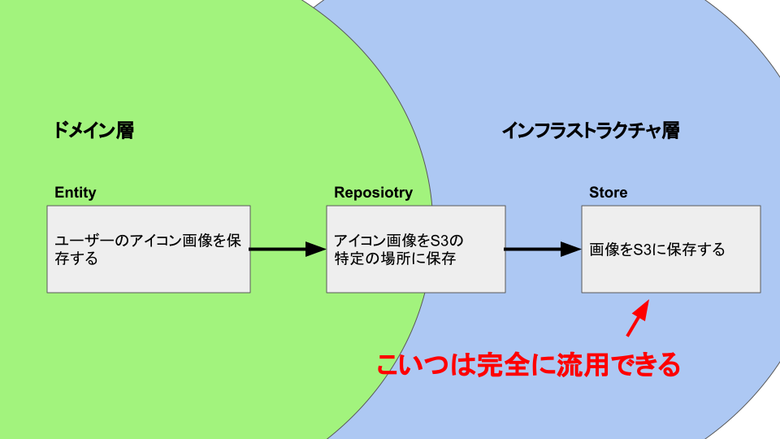

クリーンアーキテクチャでの実装でインフラストラクチャ層をドメイン層に依存しないように作れば、
再利用性が上がって他のマイクロサービスに移植しやすくなったり、共通ライブラリ化しやすくなったり、インフラストラクチャ層を他のライブラリで再実装しやすくなるという話です。


## インフラストラクチャ層はドメインの情報を持ってはいけない

例えば、「ユーザーのアイコン画像を保存したい」という要件に対して、
ドメイン層は「ユーザーのアイコン画像を保存する」を実現し、インフラストラクチャ層は「画像をS3に保存する」を実現するとしよう。
この実装自体はそれほど難しくはないだろう。「画像をS3に保存する」部分はこのように実装したとしよう。


```
class S3Store {
  public upload(filename: string, buffer: Buffer) {
    const s3 = new AWS.S3({ region: "ap-northeast-1" });
    return s3.upload( {
        Bucket: "com.hogeimage",
        Key: `/users/icons/${filename}`,
        Body: buffer,
    }).promise();
  }
}
```

では、別の機会で「ユーザーのツイート画像を保存したい」という要件を実現したい場合はどうだろう？
当然先ほど作った「画像をS3に保存する」コードが使えそうだ。
しかし、このコードがドメイン（アイコンの画像という情報）に依存していて、S3のバケットの`/users/icons/hogehoge.png`のように保存してしまうコードであるため、そのまま再利用することは難しく、幾つかの修正が必要になってしまう。


そう、インフラストラクチャ層はドメインの情報を使ってはいけないのだ。
インフラストラクチャ層はドメインの情報に依存せずに作り、必要な情報は外から注入する必要がある。
このケースだと「画像を受け取ったS3のディレクトリに保存する」コードを書くことで完全に流用できたはずだ。
保存するディレクトリはドメイン層とインフラストラクチャ層に任せれば良い（例えば「Repository」なんかがそうだ）





保存先を外部から注入することで、インフラストラクチャ層のコードは再利用性を高めることができる。

```
class S3Store {
  public upload(filepath: string, buffer: Buffer) {
    const s3 = new AWS.S3({ region: "ap-northeast-1" });
    return s3.upload({
        Bucket: "com.hogeimage",
        Key: filepath,
        Body: buffer,
    }).promise();
  }
}
```

代わりにRepositoryがインフラストラクチャ層にドメイン層の情報を注入する役目を負う。

```
class UserIconRepository {
  public save(filename: string, buffer: Buffer) {
    s3Store.upload(`/users/icons/${filename}`, buffer);
  }
}
```


このようにインフラストラクチャ層をドメイン層に依存しないように作り込むことができれば、再利用性が高まり、不要な修正が減り、よりドメイン層の開発にフォーカスできるでしょう。

