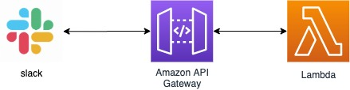

Slackのスラッシュコマンドを実装する為には、スラッシュコマンドを実行した際のリクエストを処理するサーバーが必要になってきますが、
それを [https://www.serverless.com/](Serverless framework) を使って簡単に作る方法を解説します。


今回作る構成は Node.jsを使い、AWSのAPI GatewayとLambdaを組み合わせた構成になっています。




まずは、Serverless frameworkをインストールしましょう。

```
npm install -g serverless
```

そして次のコマンドを使ってServerlessのプロジェクトディレクトリを作成します。

```
serverless create --template aws-nodejs --name serverless-simple-slack --path serverless-simple-slack
```

プロジェクトディレクトリの中に `handler.js` と `serverless.yml` ができたと思います。
`handler.js` には処理を記述し、 `serverless.yml` には実行環境の設定を記述します。

早速簡単なアプリを作ってみましょう。
`handler.js` は次のように「Hello world!」返しましょう。

```
"use strict";

module.exports.hello = async (event) => {
  return {
    statusCode: 200,
    body: JSON.stringify({
      response_type: "in_channel",
      text: "Hello world!",
    }),
  };
};

```


`serverless.yml`にはAPI GatewayとLambdaの設定をしましょう。

```
service: serverless-simple-slack
frameworkVersion: '2'

provider:
  name: aws
  runtime: nodejs12.x
  region: ap-northeast-1
  stage: ${opt:stage, 'dev'}
  # AWSのプロファイルは各自のものを使おう。
  profile: rhythm191

functions:
  hello:
    handler: handler.hello
    events:
      - http:
          path: hello
          method: post

```

早速デプロイのコマンドを実行して、正常にデプロイされることを確認しましょう。

```
serverless deploy
```

あとは [https://api.slack.com/apps](slack api) のページから「Create New App」でアプリケーションを作成します。
アプリケーションの名前とworkspaceを入力し、アプリを作成したら「Features」→「Slash Commands」から新しいスラッシュコマンドを作ります。
この時の"Request URL"にはserverless frameworkをデプロイした際の「endpoints」のURLを入力します。
そして「Settings」→「install App」のページからワークスペースに対してインストールしましょう。
slackでスラッシュコマンドを実行して結果が返ってきたら完成です。


ね。簡単でしょ