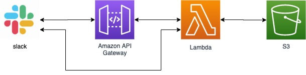
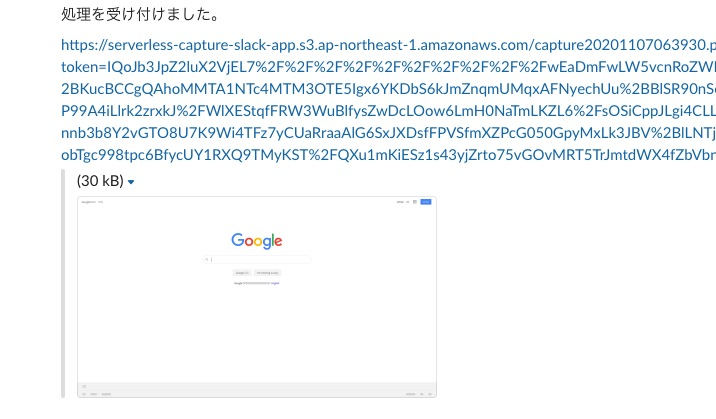

[前回](https://blog.rhyztech.net/serverless_slack_app/)は簡単なSlackのスラッシュコマンドを作りました。
今回はWebページのスナップショットを取得する実用的なスラッシュコマンドを作りかたを解説します。

今回作ったプログラムはここで公開しています。<br />
https://github.com/rhythm191/serverless-capture-slack-app


## 今回の構成。




API Gatewayでリクエストを受け付け、LambdaでPuppeteerを使ってHeadless Chromeを動かし、取得したスクリーンショットをS3に保存していきます。

ただし、注意点がふたつあります。

ひとつ目にLambdaのデプロイパッケージサイズの制限でheadless chromeのバイナリを含んだは
[Puppeteer](https://www.npmjs.com/package/puppeteer)にはHeadlees Chromeのバイナリを含んでいる為、直接デプロイすることができません。
これを解決する為にHeadless ChromeをLambdaのレイヤーとして登録し、PuppeteerはHeadless Chromeを含んでいない[puppeteer-core](https://www.npmjs.com/package/puppeteer-core)を使います。
Headless ChromeのLambdaレイヤーには[chrome-aws-lambda](https://github.com/alixaxel/chrome-aws-lambda)を使用します。

ふたつ目にSlackへのレスポンスを３秒以内に返さないとタイムアウトが発生してしまうことです。これはLambdaの処理をStep Functionsで「リクエストの受付」「キャプチャ処理」に処理を分けることで解決します。


## 開発について

まずは、Serverless frameworkをインストールし、必要なファイルを作成しましょう。
今回は、serverless frameworkのプラグインとして、`serverless-step-functions`と`serverless-pseudo-parameters`も使います。

```
npm install -g serverless serverless-step-functions serverless-pseudo-parameters
serverless create --template aws-nodejs --name serverless-snapshot-slack-app --path serverless-snapshot-slack-app
```


そして、必要なパッケージをインストールします。

```
 npm i aws-sdk axios chrome-aws-lambda puppeteer-core query-string dayjs
 ```


`handler.js` は次のように「リクエストの受付」の処理を書きます。
Lambdaの引数として渡されるeventから`response_url`を取得し、そのURLに対してPOST通信をすることでメッセージを返すことができます。
`response_type: "in_channel"`をつけることによってチャンネルにメッセージを投稿できます。（逆につけないと「Only visible to you」となり、コマンドを実行したユーザーしか見ることのできないメッセージが投稿されます。）

```
module.exports.accept = async (event) => {
  const params = queryString.parse(event.toString());

  await axios.post(params.response_url, {
    response_type: "in_channel",
    text: `処理を受け付けました。`,
  });

  return {
    channel_name: params.channel_name,
    response_url: params.response_url,
  };
};
```

「キャプチャ処理」はこのような感じです。
「chrome-aws-lambda」からchromeLambda → pupppeteeerを取得し、それを使ってHeadless Chromeを動作させます。
`page.screenshot`でキャプチャ画像を取得しますが、ここでpathを指定しないことで画像のバイナリデータを取得し、それをS3に保存しています。

```
const chromeLambda = require("chrome-aws-lambda");
const puppeteer = chromeLambda.puppeteer;

module.exports.capture = async (event) => {
  const browser = await puppeteer.launch({
    args: chromeLambda.args,
    defaultViewport: chromeLambda.defaultViewport,
    executablePath: await chromeLambda.executablePath,
    headless: chromeLambda.headless,
    ignoreHTTPSErrors: true,
  });

  const page = await browser.newPage();

  // スクリーンショットを撮りたいページにアクセスし、pngデータを取得する。
  await page.goto(`https://www.google.com/`, {
    waitUntil: "networkidle0",
  });
  const png = await page.screenshot({ fullPage: true });

  // S3にアップロードする
  await s3
    .putObject({
      Bucket: bucket_name,
      Key: filename,
      Body: png,
    })
    .promise();

  const download_url = await s3.getSignedUrlPromise("getObject", {
    Bucket: bucket_name,
    Key: filename,
    Expires: 604800,
  });

  await axios.post(event.response_url, {
    response_type: "in_channel",
    text: download_url,
  });
};

```


`serverless.yml`にはAPI GatewayとLambda、レイヤー、ステップファンクションの設定をしましょう。

```
service: serverless-capture-slack-app

frameworkVersion: '2'

provider:
  name: aws
  runtime: nodejs12.x
  region: ap-northeast-1
  stage: ${opt:stage, 'dev'}
  # プロファイルは各自のものを使おう。
  profile: rhythm191
  memorySize: 2048
  timeout: 90
  layers:
    - arn:aws:lambda:ap-northeast-1:764866452798:layer:chrome-aws-lambda:19
  iamRoleStatements:
    - Effect: "Allow"
      Action:
        - s3:PutObject
        - s3:PutObjectAcl
      Resource: arn:aws:s3:::serverless-capture-slack-app/*

package:
  exclude:
    - .prettier*

functions:
  accept:
    handler: handler.accept
  capture:
    handler: handler.capture
    timeout: 300

stepFunctions:
  stateMachines:
    captureSteps:
      name: serverless-capture-slack-app-${opt:stage, 'dev'}
      events:
        - http:
            path: serverless-capture-slack-app
            method: post
      definition:
        Comment: "capture function"
        StartAt: accept
        States:
          accept:
            Type: Task
            Resource:
              Fn::GetAtt: [accept, Arn]
            Next: capture
          capture:
            Type: Task
            Resource:
              Fn::GetAtt: [capture, Arn]
            End: true


# plugins
plugins:
  - serverless-step-functions
  - serverless-pseudo-parameters

```

デプロイのコマンドを実行して、正常にデプロイされることを確認しましょう。

```
serverless deploy
```

あとは [https://api.slack.com/apps](slack api) のページから「Create New App」でアプリケーションを作成します。
アプリケーションの名前とworkspaceを入力し、アプリを作成したら「Features」→「Slash Commands」から新しいスラッシュコマンドを作ります。
この時の"Request URL"にはserverless frameworkをデプロイした際の「endpoints」のURLを入力します。
そして「Settings」→「install App」のページからワークスペースに対してインストールしましょう。
slackでスラッシュコマンドを実行して結果が返ってきたら完成です。




ね。簡単でしょ