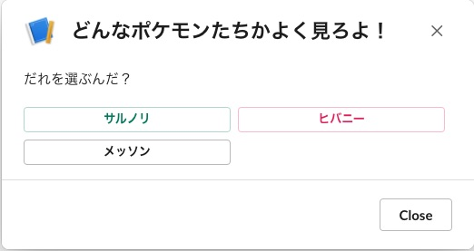

SwiftUIライクにSlackのBlock KitのUIを構築できる [「Block Builder」](https://www.npmjs.com/package/slack-block-builder) を紹介します。

SlackのBlock KitはSlackへ投稿する文章やモーダルなどのアプリをJSONで記述する必要があります。
今回紹介する Block builder というライブラリを使うことで、SwiftUIのような宣言的なスタイルでJSONを生成できます。


例えばモーダルを生成するのには次のようなコードを書きます。
`.blocks` メソッドの引数にBlocks要素を渡すことで、コンテンツの定義をしていきます。


```
import { Modal, Blocks, Elements } from "slack-block-builder";

const myModal = () => {
  return Modal({ title: "どんなポケモンたちかよく見ろよ！" })
    .blocks(
      Blocks.Section({ text: "だれを選ぶんだ？" }),
      Blocks.Actions().elements(
        Elements.Button({
          text: "サルノリ",
          actionId: "grookey",
          value: "grookey",
        }).primary(),
        Elements.Button({
          text: "ヒバニー",
          actionId: "scorbunny",
          value: "scorbunny",
        }).danger(),
        Elements.Button({
          text: "メッソン",
          actionId: "sobble",
          value: "sobble",
        })
      )
    )
    .buildToJSON();
};

```


このようなJSONオブジェクトが生成されます。


```
{
  "title": { "type": "plain_text", "text": "どんなポケモンたちかよく見ろよ！" },
  "blocks": [
    {
      "text": { "type": "mrkdwn", "text": "だれを選ぶんだ？" },
      "type": "section"
    },
    {
      "elements": [
        {
          "text": { "type": "plain_text", "text": "サルノリ" },
          "action_id": "grookey",
          "value": "grookey",
          "style": "primary",
          "type": "button"
        },
        {
          "text": { "type": "plain_text", "text": "ヒバニー" },
          "action_id": "scorbunny",
          "value": "scorbunny",
          "style": "danger",
          "type": "button"
        },
        {
          "text": { "type": "plain_text", "text": "メッソン" },
          "action_id": "sobble",
          "value": "sobble",
          "type": "button"
        }
      ],
      "type": "actions"
    }
  ],
  "type": "modal"
}

```

このようなモーダルダイアログが生成できます。




<br/>
<br/>


また、Builderインスタンスを変数に保存して、複数回 `.blocks` メソッドを呼び出すことができます。
これによって、条件分岐やループ処理などの、条件ごとのコンテンツの生成が簡単にできます。

```
const message = Message().blocks(
    Blocks.Section().text(`複数回呼び出すテスト`),
    Blocks.Divider(),
);

contentList.forEach((content) => {
  message.blocks(
    Blocks.Section().text(content.text)
  )
})

```