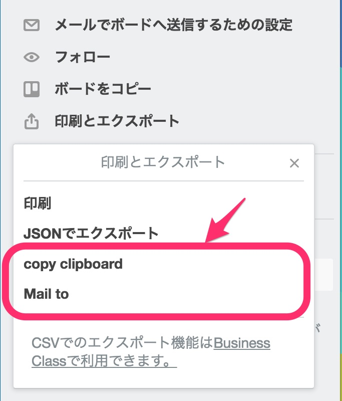

[https://chrome.google.com/webstore/detail/npombkniehmhjlbjnfgjkfnjfmcjnfne](https://chrome.google.com/webstore/detail/npombkniehmhjlbjnfgjkfnjfmcjnfne)

Trello のエクスポートに次の機能を追加する Chrome 拡張機能。

- メールでのエクスポート
- クリップボードにコピー

### 使い方

1. 「ボードメニュー」 -> 「印刷とエクスポート」を開く
2. 「copy clipboard」 or 「Mail to」を選ぶ
